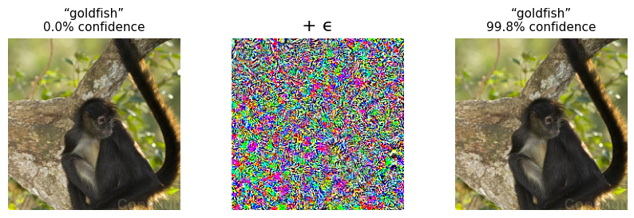

# 🧠 Adversarial Image Attacks

This project demonstrates how to generate adversarial noise to fool pretrained image classification models (e.g., ResNet18) to misclassify an images as a specified target class. The goal is to perturb input images with the generated adversial noise so that a neural network misclassifies them into a specified target class, while the perturbation remains imperceptible to the human eye.

## 📸 Example Result

<p align="center">
  
</p>

An image of a "spider monkey” is perturbed to be classified as a “goldfish” with high confidence by the model. The Projected Gradient Descent (PGD) algorithm was used to generate the presented image. 

---

## 📦 Features

- 🔍 Support two adversial noise generation algorithms Fast Gradient Sign Method (FGSM) and Project Gradient Descent (PGD) attacks
- 🖼️ Visualizations of original image, perturbation, and adversarial result
- 📊 Confidence scores for original and adversarial predictions
- 🧪 Jupyter notebook demo and CLI interface
- 🧠 Works with any torchvision-compatible model (e.g., ResNet, ViT)

---

## 📁 Project Structure

```
adversarial_noise_code_challenge/
├── adversarial_attack_lib/
│   ├── __init__.py           
│   ├── attack.py             # Algorithms to generate adversarial images
│   ├── model.py              # Load models and preprocess image data helper functions
│   ├── runner.py             # Helper function to run adversarial image generation function 
│   └── utils.py              # Helper functions (get prediction confidence and visualize outputs)
│
├── main.py                   # CLI main entry point
├── examples/
│   └── original_images/      # Sample input images
│   └── AdversarialDemo.ipynb # Interactive demo with visualizations
├── results/                  # Output images (original, adversarial)
|
├── README.md
└── requirements.txt
```

---

## 🚀 Getting Started

### 1. Install Requirements

```bash
pip install -r requirements.txt
```

### 2. Run Python Script from the Command Line

```bash
python main.py \
  --image examples/original_images/monkey.JPEG \
  --target_class goldfish \
  --attack pgd \
  --epsilon 0.03 \
  --model resnet18 \
  --alpha 0.005 \
  --steps 10
```

### 3. Run from Jupyter Notebook

Use `examples/AdversarialDemo.ipynb` to experiment interactively.

---

## ✏️ Example Usage (Python)

```python
from adversarial_attack_lib.runner import run_attack

result = run_attack(
    image_path="examples/original_images/dog.JPEG",
    target_class="goldfish",
    attack_type="pgd",
    epsilon=0.03,
    alpha=0.005,
    steps=10,
    model_name="resnet18",
    save_output=True
)

# Visualize result
from adversarial_attack_lib.utils import visualize_attack
visualize_attack(result)
```

---

## ✅ Requirements

- Python 3.8+
- PyTorch
- torchvision
- matplotlib
- Pillow

---

## ✅ To Do

 - [ ] Add additional early stopping conditions for the PGD algorithm implementation (i.e. stop when prediction confidence in target class is above a specified threshold)
 - [ ] Update attack methods to support untargeted attacks also (i.e. just minimize the confidence in the true class label)
 - [ ] Add evaluation of k-top class predictions (i.e. what classes are increase in prediction confidence following addition of the adversarial noise)
 - [ ] Include a methods to counteract the affect of or detect images with adversarial noise (i.e. detect adversial images by using a auxillary classifier to detect perturbations -> input gradient norms could be used as an anomaly signal)

---

## 🧠 Author

Created by John E. Fleming 